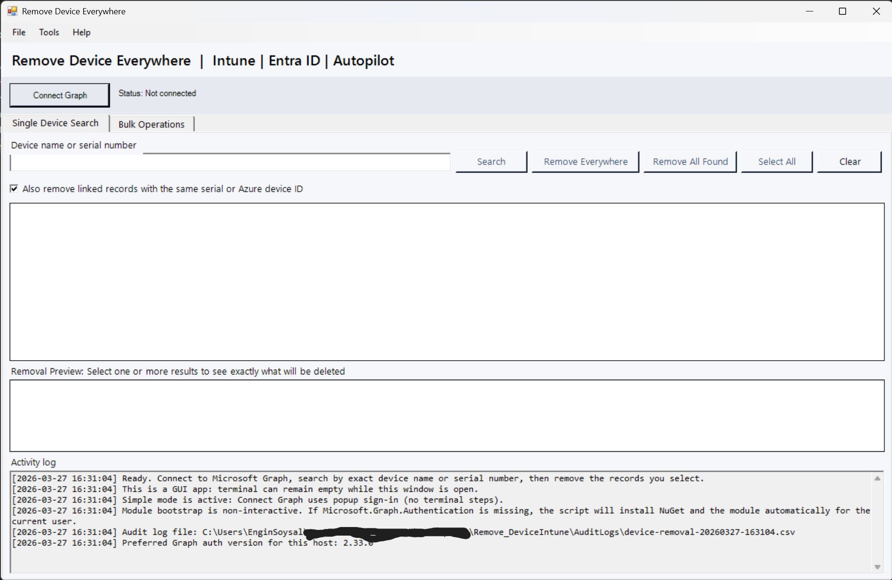
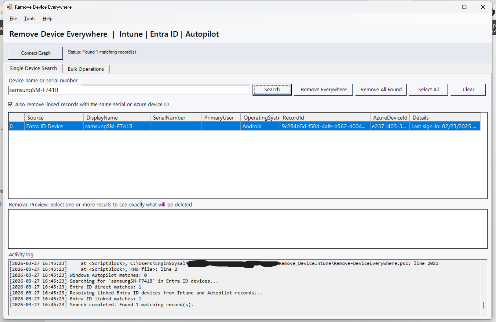
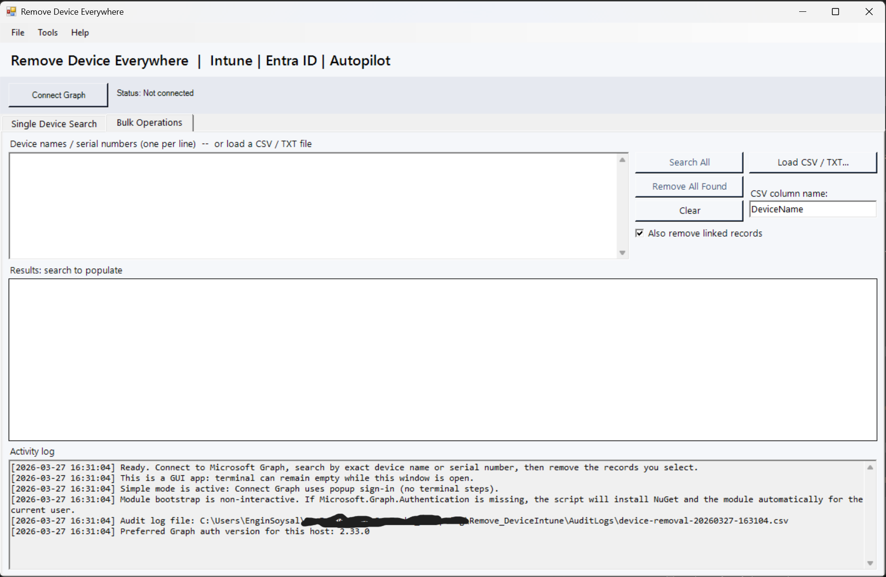
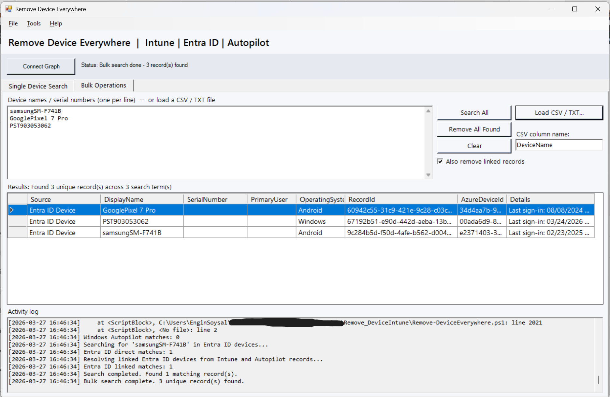

# Remove Device Everywhere

**One GUI to find and remove device records across Intune, Entra ID, and Autopilot in minutes, not hours.**

## Problem

Device cleanup is messy in real environments.

- Records live across multiple Microsoft portals.
- Device naming is inconsistent.
- Stale, duplicate, or orphaned records break admin workflows.
- Manual cleanup is slow and error-prone.

## Solution

Remove Device Everywhere gives IT admins a single PowerShell GUI to search and remove matching records across:

- Microsoft Intune
- Microsoft Entra ID (Azure AD)
- Windows Autopilot

You search once, review results, confirm, and clean up from one place.

## Features

Single Device Search:





- GUI-first workflow (no day-to-day terminal usage required)
- Exact search by device name or serial number
- Multi-source results in one grid (Intune, Entra, Autopilot)
- Removal Preview to see what will be deleted before action
- Optional linked cleanup by serial/Azure device ID
- Remove selected items or **Remove All Found**
- Bulk mode using CSV input
- Built-in CSV audit logging for traceability

## Safety Notice

This tool performs **permanent deletions**.

- Every removal action requires confirmation.
- Use the preview and confirmation dialog carefully.
- Validate search results before clicking remove.

## Installation

### Option 1: PowerShell Gallery

```powershell
Install-Script -Name Remove-DeviceEverywhere -Scope CurrentUser
```

Then run:

```powershell
Remove-DeviceEverywhere.ps1
```

### Option 2: Manual from GitHub

1. Clone or download this repository.
2. Open PowerShell in the project folder.
3. Run:

```powershell
Set-ExecutionPolicy -Scope Process Bypass
.\Remove-DeviceEverywhere.ps1
```

## Usage

1. Launch the script.
2. Click **Connect Graph** and complete sign-in.
3. Search by exact device name or serial.
4. Review found records and preview.
5. Remove selected records (or remove all found).
6. Check audit log output.

## Permissions Required

Graph delegated permissions requested:

- `DeviceManagementManagedDevices.ReadWrite.All`
- `DeviceManagementServiceConfig.ReadWrite.All`
- `Directory.AccessAsUser.All`

Required admin roles depend on scope, typically:

- Intune Administrator
- Cloud Device Administrator
- Or another role with equivalent delete rights

## Audit Logging

Every delete attempt is written to CSV in `AuditLogs`.

Each row includes:

- Timestamp
- Operator
- Search term
- Source system
- Device identifiers
- Outcome (Deleted/Failed)
- Message

This gives you a clean operational trail for change tracking and review.

## Bulk Operations

Bulk Operations:





Bulk mode accepts CSV input (for device names or serials).

- Load CSV
- Search all rows
- Review consolidated results
- Remove in controlled batches

Ideal for large cleanup jobs and migration waves.

## Prerequisites

- Windows PowerShell 5.1 or PowerShell 7 on Windows
- Internet access to Microsoft Graph
- Rights to install `Microsoft.Graph.Authentication` for current user
- Account with appropriate Graph permissions and directory roles

## Example Use Cases

- Tenant cleanup after pilot/test devices
- Migration projects with duplicate records
- Removing stale hybrid/AAD-joined leftovers
- Autopilot and Intune record cleanup before re-enrollment

## Contributing

Issues and pull requests are welcome.

- Keep changes focused.
- Add/update tests when behavior changes.
- Prefer clear admin-focused UX and safe defaults.

## License

MIT License. See `LICENSE`.

Stop cleaning devices manually across multiple portals.